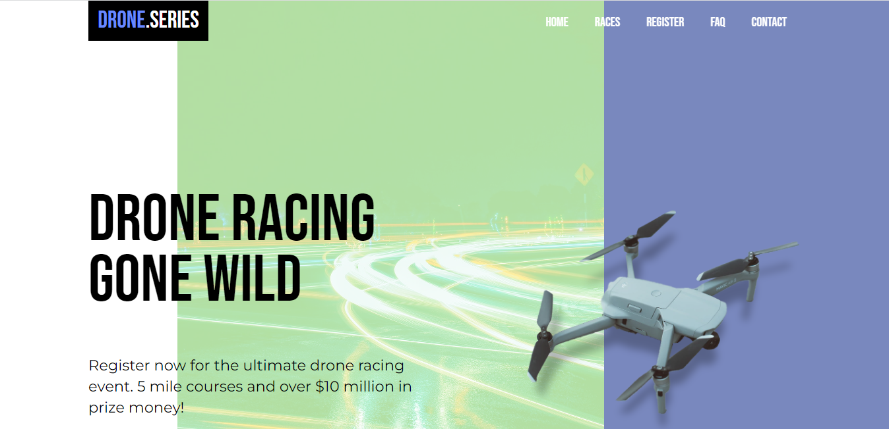

# drone-event-site
## Overview
`Drone Event` website was built for understanding basics of HTML, CSS and JavaScript.

## Screenshot:


## 🚀 Usage
Run this commands in your terminal.
```shell
 git clone https://github.com/mhshahandeh/drone-event-site.git
```
Enjoy adding features.
